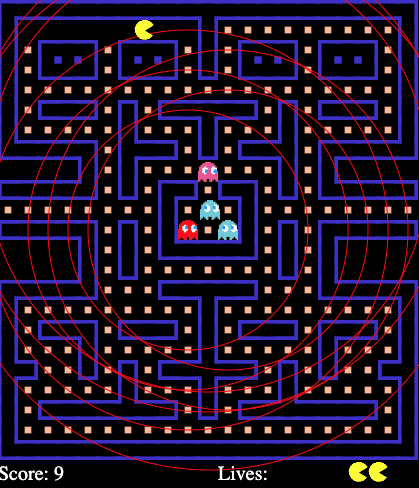

# 🟡 JavaScript Pac-Man Game

A classic Pac-Man arcade game re-created in modern JavaScript, HTML, and CSS. Navigate the maze, eat pellets, avoid ghosts, and chase high scores—all in your browser! This project demonstrates fun game AI, grid-based navigation, and interactive design.

---

## 🚀 Features

- Full implementation of Pac-Man (player, ghosts, pellets, fruit, and scoring)
- Smart ghost AI with different behaviors (Blinky, Pinky, Inky, Clyde)
- Classic maze layout with grid-based logic
- Smooth player and ghost animation
- Counting score, lives, high score tracking (in browser)
- Keyboard controls (WASD or arrows)
- Responsive, works in any modern browser
- Organized clean JS code with modular structure

---

## 🛠️ How to Run

1. **Clone this repository:**
git clone https://github.com/SubodhKumarSahu2826/paceman_game.git
2. **Open `pacman.html` in your browser** (no build step required).
 - All game logic is in `pacman.js`, `ghost.js`, and `game.js`.
 - Assets: See included images and sprite sheets.

3. **Controls:**
 - Use arrow keys or WASD to move.
 - Eat all pellets to win each level.
 - Avoid the ghosts, or eat them after collecting a power pellet!

## 🧠 About This Project

This Pac-Man implementation is a fun exploration of classic game mechanics, pathfinding, and browser graphics. 
- Perfect for learning JS event handling, grid-based logic, and simple AI.
- The code is modular and fully commented for educational use.

**Inspired by the legendary arcade game, all rights for the concept are owned by Namco. This is a non-commercial, educational project.**
